# Amble AI — Architecture

> **Last updated:** 2026-06-14
> **Companion doc:** [SOURCE_OF_TRUTH.md](./SOURCE_OF_TRUTH.md) — feature inventory, changelog, roadmap, and the plan→build→deploy workflow.
> **Scope:** How the system is built and how data flows through it. Diagrams are [Mermaid](https://mermaid.js.org/) — they render in GitHub and in VS Code with the *Markdown Preview Mermaid Support* extension.

---

## 1. What Amble AI Is

Amble AI is a **multi-modal AI assistant platform** for healthcare / pharmacy operations. It is a single Next.js (App Router, SSR) application deployed to **Firebase Hosting**, where *every* request is rewritten to a single Cloud Function (`ssrambleai`) that both serves React pages and runs the heavy API handlers.

It bundles five product surfaces behind one permission-gated shell:

| Surface | What it does |
|---------|--------------|
| **Amble AI (Chat)** | Streaming multi-model chat (GPT-5 / Gemini 3) with RAG, web search, tools, agents, projects, artifacts |
| **Billing CX** | Drafts patient/billing replies that obey configurable tone/format/style policies; rewrite + PDF export |
| **Knowledge Base** | Google Drive → Firestore sync, chunking, embeddings, hybrid vector+keyword retrieval |
| **Media Studio** | Image generation (DALL·E / Imagen) and video generation (Sora / Veo) with a gallery |
| **RxConnect** | Embedded external pharmacy portal (`https://rxconnect.tweaking.agency`) shown in-app via iframe |
| **Dashboard / News** | Company news feed (editorial layout, admin CRUD) + usage dashboard |

| | |
|---|---|
| **Live URL** | https://amble-ai.web.app |
| **Firebase project** | `amble-ai` (project number `1064927104823`) |
| **SSR function** | `ssrambleai` (Cloud Functions v2, `us-central1`, Node 22, 2 GiB, 540 s) |
| **Repo** | local `main`; GitHub remote `Havs5/Amble-AI` |

---

## 2. Tech Stack

| Layer | Technology |
|-------|-----------|
| Framework | Next.js ^15 (App Router, SSR) |
| UI | React 18.3, TypeScript 5 (strict), Tailwind CSS v4, lucide-react, markdown-it, recharts, sonner |
| Backend | Firebase Cloud Functions v2 (Node 22) |
| Database | Firestore (vector + composite indexes) |
| Storage | Firebase Storage (`amble-ai.firebasestorage.app`) |
| Auth | Firebase Auth (Email/Password + Google OAuth w/ Drive scope) |
| AI — chat | OpenAI GPT-5 / GPT-5-mini / GPT-5-nano / GPT-5.2; o3 / o4-mini; Google Gemini 3 / 2.5 |
| AI — embeddings | OpenAI `text-embedding-3-small` (1536-dim) |
| AI — media | DALL·E 3, Imagen 3 (image); Sora, Veo (video) |
| AI — audio | Whisper-1 (STT), TTS-1 (TTS) |
| Search | Google Custom Search (primary), Tavily (fallback/extract) |
| KB source | Google Drive API (service account + per-user OAuth) |
| Testing | Jest 30, ts-jest, @testing-library/react, jsdom |
| PDF | @react-pdf/renderer (dynamic import) |
| Validation | Zod on API boundaries |

---

## 3. Deployment Topology

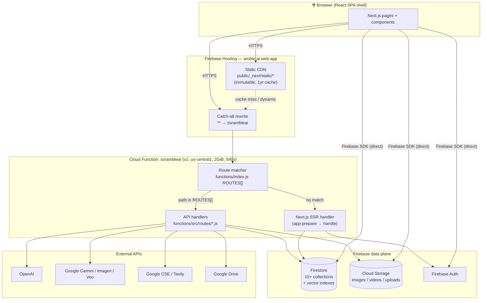

**Key idea — dual execution model.** In production the Cloud Function checks an explicit route table **first**. If the path matches (`/api/chat`, `/api/image`, …) the **Functions handler runs**; otherwise the request falls through to the **Next.js SSR handler**, which renders pages and serves any Next.js-only API routes. Many routes exist in *both* `functions/src/routes/` and `src/app/api/` — **the Functions copy always wins in prod** (the Next.js copy only runs in local `next dev`). See [§9](#9-api-surface).

---

## 4. Request Routing

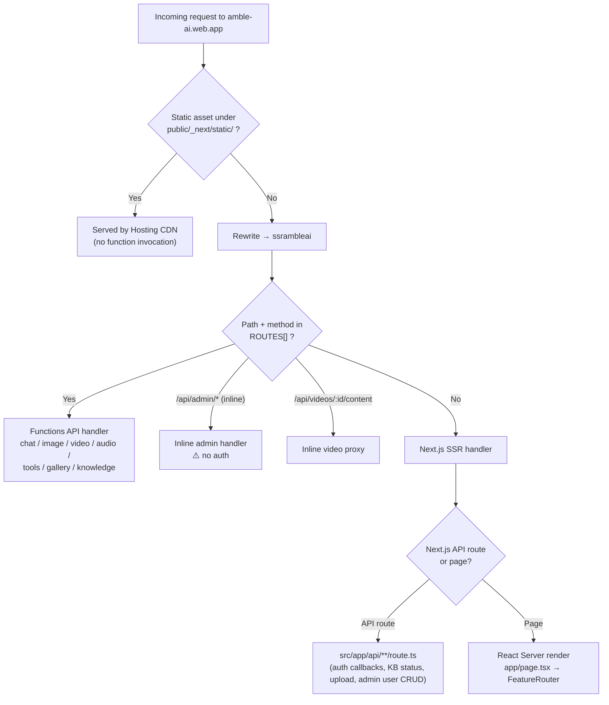

The single React entry (`app/page.tsx`) renders a **`FeatureRouter`** that switches between surfaces based on `useAppNavigation()` state (`dashboard | amble | billing | veo | knowledge | pharmacies`). Each surface is permission-gated (see [§8](#8-auth--permissions)).

**Keep-alive views.** `FeatureRouter` does **not** unmount a surface when you navigate away. Each view is mounted the first time it becomes active and then kept mounted, with inactive views hidden via `display:none` (the `KeepAlive` wrapper). This makes tab switches instant (no remount, no re-fetch — which also stops the heavy synchronous remount that previously janked the sidebar collapse) and **preserves per-tab state**: scroll position, the open Knowledge Base document, in-progress chat/billing drafts, and the loaded RxConnect session all survive navigation. Views are still code-split via `next/dynamic`, so a surface's bundle only loads on first visit.

---

## 5. Module Layout

```
src/
├── app/                     Next.js routes
│   ├── page.tsx             Single entry → FeatureRouter (view switch)
│   ├── embed/               Embeddable chat widget
│   └── api/**/route.ts      20 Next.js API routes (dev + SSR-fallthrough)
├── components/              52 components across 14 domains
│   ├── chat/ (10)           Composer, message list, thinking panel, artifacts
│   ├── views/ (4)           DashboardView, BillingView, KnowledgeBaseView, PharmacyView (RxConnect iframe)
│   ├── studio/ (4) veo/ (4) Image + video studio
│   ├── news/ (5)            Editorial news feed + PostEditor
│   ├── modals/ (6)          User mgmt, settings, etc.
│   ├── auth/ (2)            AuthContextRefactored, LoginRefactored
│   ├── layout/ (5) ui/ (5)  Sidebar, shell, primitives
│   └── admin/ ai/ billing/ gallery/ organization/ settings/
├── contexts/                ChatContextRefactored, OrganizationContext
├── hooks/                   ~15 hooks (navigation, model selection, auth, dictation, news, projects)
├── lib/                     Firebase init, agents, systemPrompt, rateLimiter, semanticCache, constants
├── services/                Business logic (singletons)
│   ├── ai/                  router (MagicRouter), memory, rag, tools, agentSystem, ModelGateway
│   ├── auth/                AuthService, SessionService
│   ├── chat/                SessionService, StreamingService
│   ├── knowledge/           RAGPipeline, KnowledgeBaseManager, EmbeddingService, DriveSync, DriveSearchService
│   └── ui/                  client-side helpers
├── types/  utils/           Shared types + pure utilities
└── __tests__/               Jest suites (services, hooks, integration)

functions/
├── index.js                 SSR entry + ROUTES[] table + inline admin handlers
└── src/
    ├── config/              Pricing tables
    ├── routes/              chat, image, video, audio, tools, gallery, knowledge, driveSync, videoAnalyze
    ├── services/            Drive, search, knowledge, usage
    └── utils/               Response helpers
```

172 TS/TSX source files. Architectural patterns: **service-layer singletons**, **React context providers** for chat/org state, **permission-gated FeatureRouter**, and **Zod-validated API boundaries**.

---

## 6. Chat Message Lifecycle

The core flow. A user message travels client → SSE stream → multi-source context → model → streamed tokens back.

```mermaid
sequenceDiagram
    participant U as User / Composer
    participant CC as ChatContext
    participant SS as StreamingService
    participant RT as /api/chat (Functions in prod)
    participant CTX as Context sources (×4)
    participant M as Model (Gemini / OpenAI)
    participant FS as Firestore

    U->>CC: sendMessage(text, attachments, mode)
    CC->>FS: create session if none (chats/{id})
    CC->>CC: optimistic user message + analyzeQuery()
    CC->>SS: stream({messages, model, stream:true, ...})
    SS->>RT: POST /api/chat (SSE)
    RT->>RT: rate-limit + Zod validate
    alt agentMode set
        RT->>RT: globalExecutor.execute(agent, query)
    else normal
        RT->>RT: MagicRouter.detectComplexity() → pick model
        RT->>CTX: fetchContextParallel() (Promise.allSettled)
        Note over CTX: Memory · project RAG · vector KB · legacy KB
        CTX-->>RT: merged context + kbSources
        RT->>RT: buildSystemPrompt() + determineWebSearch()
    end
    RT->>M: stream completion (+ tools / googleSearch)
    loop tool turns (max 5)
        M-->>RT: content deltas / tool_calls
        RT->>RT: ToolExecutor.execute() → re-prompt
        RT-->>SS: SSE trace + content events
    end
    SS-->>CC: 50ms-batched chunks + trace + usage
    RT->>M: extract memories (fire-and-forget, gpt-4o-mini)
    CC->>FS: save messages + usage_logs; auto-title new chat
```

**SSE event protocol** (`data:` JSON lines, terminated by `[DONE]`):

| `type` | Payload | Used for |
|--------|---------|----------|
| `trace` | `{event, status, message}` | "thinking" panel (which context phase is running) |
| `content` | `{text}` | Streamed answer tokens |
| `usage` | `{promptTokens, completionTokens, model}` | Token + cost tracking |
| `kbSources` | `{sources:[{name, path}]}` | Citation chips |

---

## 7. AI Pipeline

### 7.1 Model routing (MagicRouter)

`services/ai/router.ts` classifies each query into a complexity tier, then `route.ts` maps the tier + provider preference to a concrete model. Default provider preference is **Google** (cost), with **automatic fallback to OpenAI** on any Gemini error.

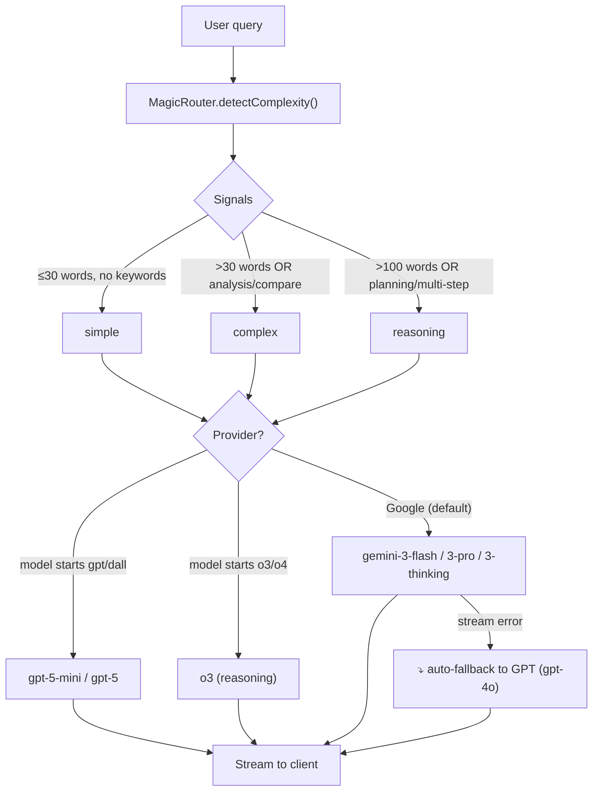

| Tier | Trigger | Google model | OpenAI model |
|------|---------|--------------|--------------|
| `simple` | default | `gemini-3-flash` | `gpt-5-mini` |
| `complex` | >30 words / analysis | `gemini-3-pro` | `gpt-5` |
| `reasoning` | >100 words / planning | `gemini-3-thinking` | `o3` |

Provider selection: `o3*`/`o4*` → OpenAI reasoning; `gpt*`/`dall*` → OpenAI; otherwise → Google. Fallbacks also exist for `generateImage()` (DALL·E → Imagen) and `generateText()` (GPT → Gemini).

### 7.2 Four-source parallel context retrieval

`fetchContextParallel()` runs four knowledge sources concurrently via `Promise.allSettled`, then assembles a token-budgeted system prompt. If structured KB finds nothing, it falls back to live Drive search.

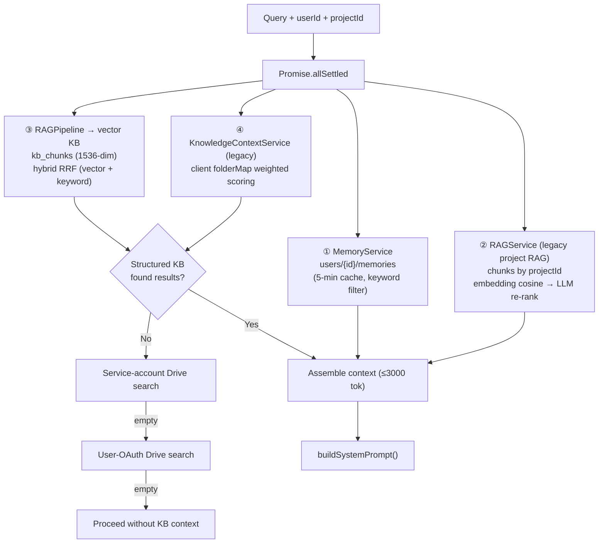

> **Known redundancy:** three server-side context systems (`RAGService`, `RAGPipeline`/`KnowledgeBaseManager`, `KnowledgeContextService`) all fire on every request. Consolidation is tracked in the [SOT roadmap](./SOURCE_OF_TRUTH.md#roadmap--backlog).

### 7.3 Agent system

When `agentMode` is set, `route.ts` delegates to `globalExecutor` (singleton `AgentExecutor`). Agents call the model via `ModelGateway` (non-streaming `/api/chat`) and loop on tool calls (max 5 steps each).

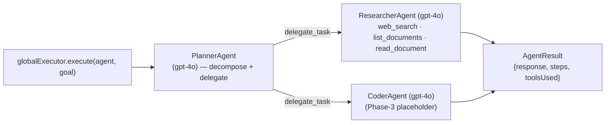

**Server tools** (`ToolExecutor`): `get_patient_details`, `search_billing_codes`. **Agent tools:** `delegate_task`, `web_search`, `web_extract`, `list_documents`, `read_document`. **Google-side:** `googleSearch` + `thinkingConfig` passed to Gemini when needed.

---

## 8. Auth & Permissions

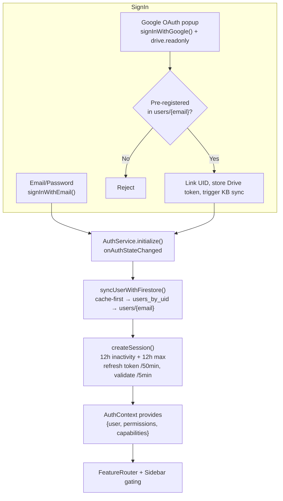

**Permissions** gate whole surfaces: `accessAmble`, `accessBilling`, `accessKnowledge`, `accessPharmacy`. **Capabilities** gate features: `enableStudio`, `dictation`, `webBrowse`, `imageGen`, etc. **Admin-only** (`role==='admin'`): user management, pre-registration, KB admin, news CRUD (also enforced by Firestore rules).

> ⚠️ **Security note:** most API routes trust a `userId` in the body without verifying the Firebase ID token, and the inline `/api/admin/*` Functions handlers have **no auth**. Firestore rules are the real security boundary. Tracked in the [SOT](./SOURCE_OF_TRUTH.md#known-issues--risks).

---

## 9. API Surface

All paths resolve through `ssrambleai`. "Source" = which implementation actually runs in **production**.

| Method | Path | Prod source | Auth | Purpose |
|--------|------|-------------|------|---------|
| POST | `/api/chat` | Functions | rate-limit | Streaming chat + RAG + tools + agents |
| POST | `/api/image` | Functions | — | DALL·E 3 / Imagen 3 → Storage |
| POST | `/api/veo` | Functions | — | Sora / Veo video (poll → Storage) |
| POST | `/api/transcribe` | Functions | — | Whisper STT (+ GPT correction) |
| POST | `/api/rewrite` | Functions | — | Shorter/Firmer (likely orphaned; BillingView now uses `/api/chat`) |
| POST | `/api/audio/speech` | Functions | — | TTS-1 → base64 MP3 |
| POST | `/api/tools/search` | Functions | — | Google CSE → Tavily fallback |
| POST | `/api/tools/extract` | Functions | — | Tavily URL extraction |
| GET/DELETE | `/api/gallery` | Functions | userId | List / delete generated assets |
| POST | `/api/knowledge/search` | Functions | Bearer | Vector KB + Drive search |
| POST | `/api/knowledge/drive-sync` | Functions | Bearer + token | Drive → Firestore KB sync |
| POST | `/api/knowledge/ingest` | Functions only | — | Chunk + embed a doc |
| POST | `/api/kb/search` | Functions only | — | Project-scoped RAG |
| POST | `/api/video/analyze` | Functions only | — | Gemini video analysis |
| POST | `/api/admin/fix-duplicates` | Functions inline | ⚠️ none | Dedupe users |
| POST | `/api/admin/restore-users` | Functions inline | ⚠️ none | Restore users |
| GET | `/api/videos/:id/content` | Functions inline | — | Proxy OpenAI video bytes |
| GET | `/api/auth/google/callback` | Next.js | OAuth state | Store Drive tokens |
| POST | `/api/auth/google/refresh` | Next.js | Bearer | Refresh Drive token |
| POST | `/api/admin/create-user` · `/delete-user` | Next.js | admin | User CRUD |
| GET | `/api/knowledge/status·documents·drive-list·debug` | Next.js | — | KB UI polling |
| POST | `/api/knowledge/sync` | Next.js | — | Trigger sync |
| POST | `/api/upload` | Next.js | — | File upload → Storage |

**Rate limits** (in-memory per instance, reset on cold start): chat 20/min, image 5/min, veo 2/5min, tools 30/min, kb 50/min, audio 10/min, default 100/min.

---

## 10. Data Model (Firestore)

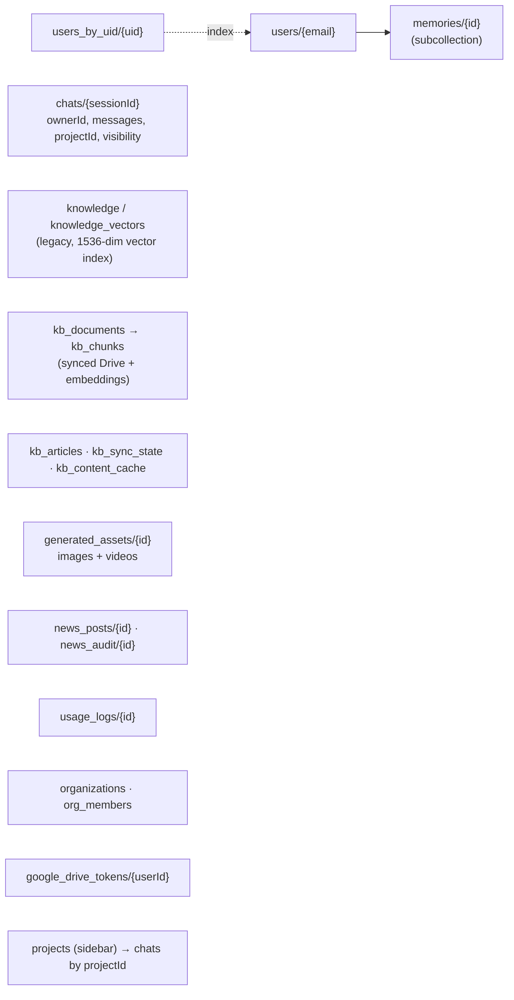

**Indexes:** vector (COSINE, 1536-dim) on `knowledge` + `knowledge_vectors`; composites on `chats(ownerId/projectId+updatedAt)`, `generated_assets(userId+createdAt)`, `kb_articles(status+publishedAt)`, `news_posts(status+publishedAt)` and `(status+pinned+publishedAt)`.

**Caching layers:** `clientCache` (localStorage 5min–24h), `SemanticCache` (localStorage 24h, Jaccard ≥0.85 dedupe), in-memory caches in Memory/RAG/Embedding services, `KBIndexer` (IndexedDB 1h), `kb_content_cache` (Firestore 24h).

---

## 11. Knowledge Base Sync

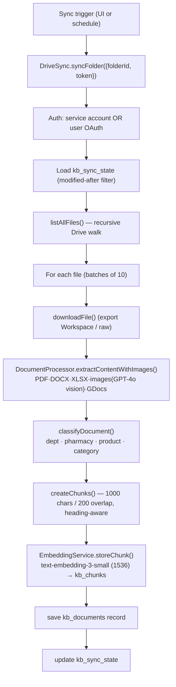

Retrieval over the synced KB is **hybrid**: a vector path (query embedding → paginated Firestore scan up to 5000 → cosine) fused with a keyword path (content×1, name×3, exact-phrase bonus) via **Reciprocal Rank Fusion (k=60)**, deduped to max 3 chunks/doc, min score 0.3.

---

## 12. Media Generation

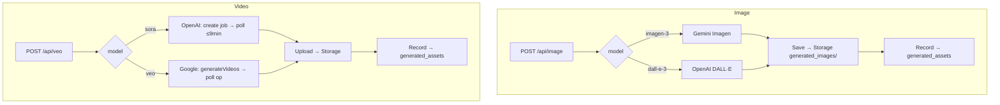

---

## 13. Billing CX Draft Flow

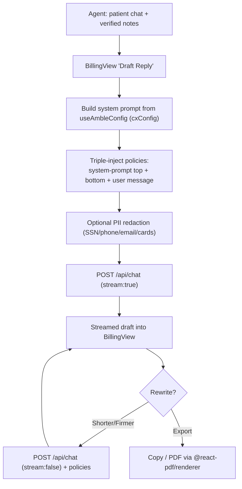

The **triple-injection** strategy combats LLM attention dilution so configured tone/format/style policies are actually followed in drafts.

---

## 14. Build & Deploy

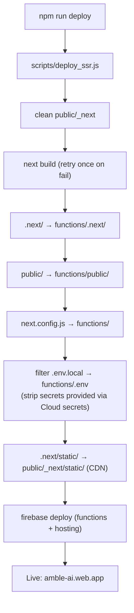

**Function config:** Node 22, `us-central1`, 2 GiB, 540 s timeout, secrets `OPENAI_API_KEY` · `GEMINI_API_KEY` · `TAVILY_API_KEY` · `GOOGLE_SEARCH_API_KEY` · `GOOGLE_SEARCH_CX`. **Hosting:** static `_next/static/*` served by CDN (immutable 1yr); everything else → function. **No CI/CD yet** — deploys are manual.

> ⚠️ **Project identity:** deploy targets whatever `.firebaserc` / `.env.local` point at. After the rotceh-2 → amble-ai revert (see [SOT](./SOURCE_OF_TRUTH.md#project-identity--the-revert)), confirm `firebase use` is `amble-ai` before deploying.

---

## 15. Cross-Cutting Concerns

| Concern | Where | Notes |
|---------|-------|-------|
| Rate limiting | `lib/rateLimiter.ts` | in-memory sliding window, per instance |
| Response caching | `lib/semanticCache.ts` | Jaccard ≥0.85 dedupe, 24h |
| System prompt | `lib/systemPrompt.ts` **and** inline in `route.ts` | ⚠️ duplicated — drift risk |
| Usage/cost | `usage_logs` + `functions/src/config` pricing | per-model token pricing |
| Validation | Zod schemas on API boundaries | strict mode TS throughout |
| Observability | `@opentelemetry/api` present | minimal wiring |
| Tests | `src/__tests__` | services + hooks + integration; 50% coverage threshold |

For the running list of issues, redundancies, and the prioritized cleanup plan, see **[SOURCE_OF_TRUTH.md](./SOURCE_OF_TRUTH.md)**.
